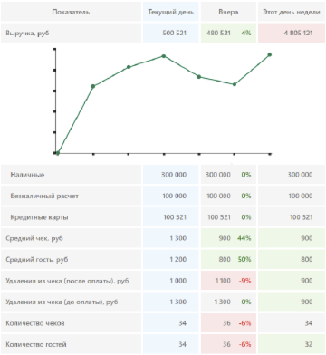

# Delta. Тестовое задание

**Сайт:** https://www512.github.io/delta-test-task/

- Сверстать таблицу (как на картинке) - реактивно JS-фреймворком или вручную.
- При выборе (кликом) строки таблицы - появляется график с данными по этой строке.
- Для отображения графика можно использовать сторонний компонент, например https://www.highcharts.com/demo или другой.

